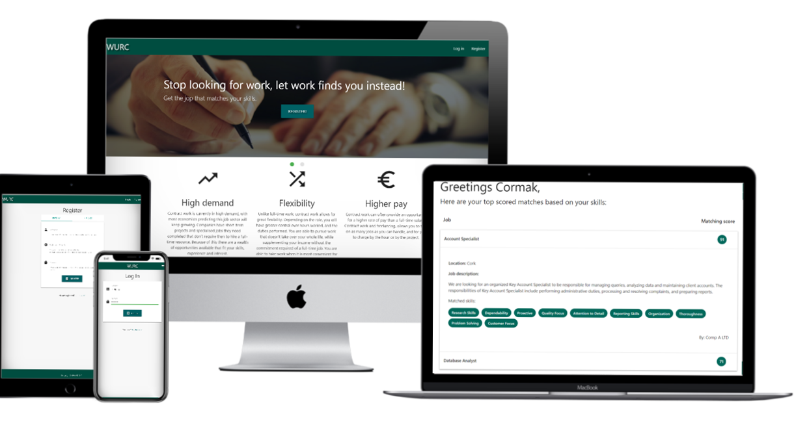
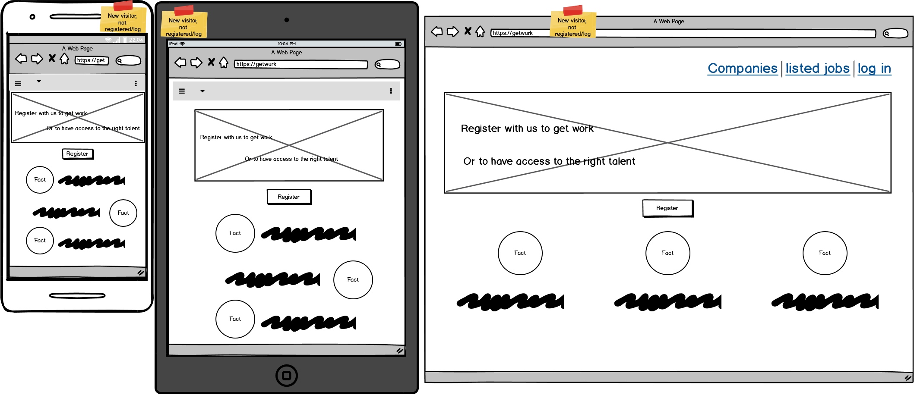
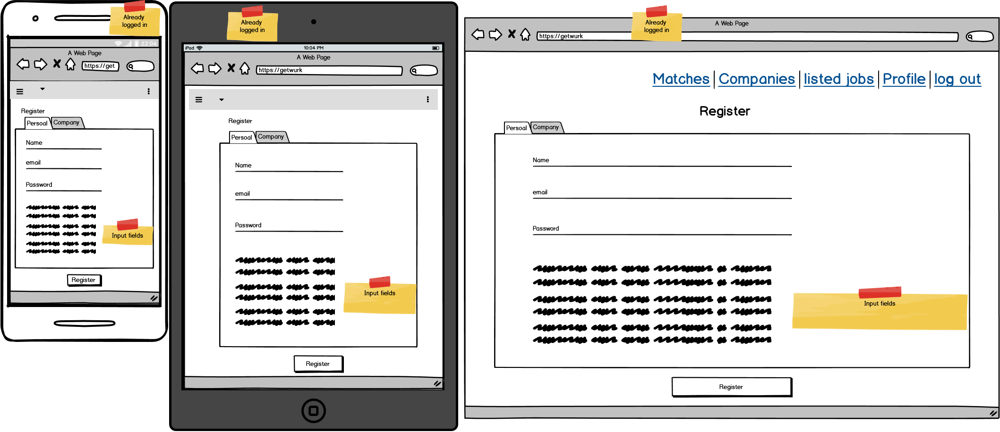
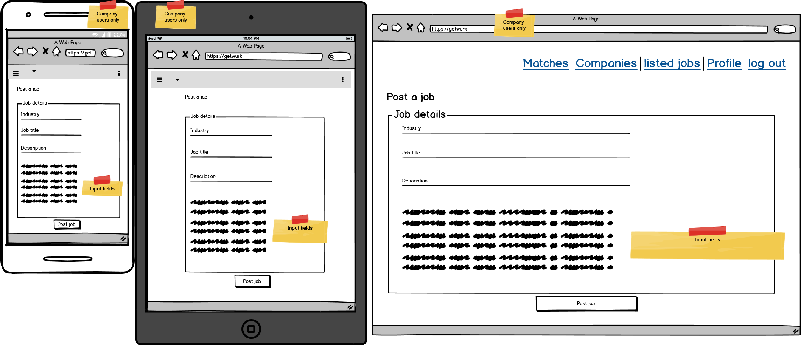
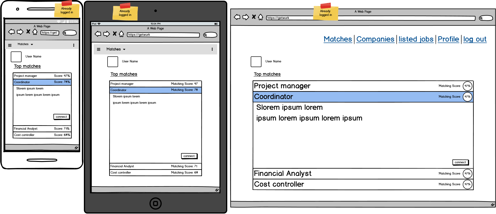
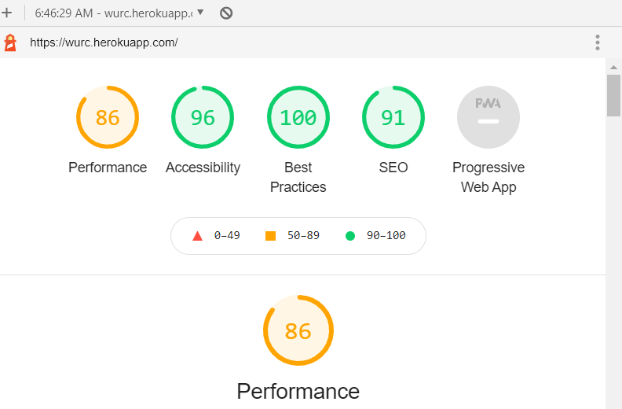
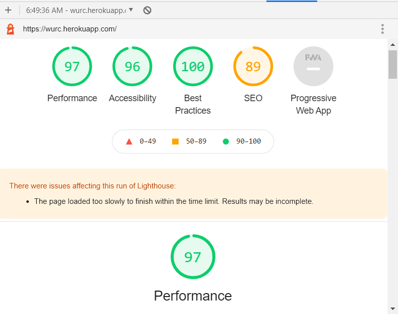

# WURC: The auto matching Job board

wurc project live page [here](https://wurc.herokuapp.com/)

This is a job board site with an automatic matching functionality, it has two types of users; personal and business (companies/organizations). personal users can log in, fill their details, and get jobs matched to the details of their profile. Business users can log in, post a job whenever they need to, and get profiles presented to them based on the best matches from the personal users.

## User Experience (UX)

-   ### User stories

    -   #### Personal users
        As an individual seeking work, I want:
        1. An easy sign up step.
        2. A simple, straight forward, not too long profile page to fill, with ability to edit my details when I want to.
        3. To get my matches (jobs) as soon as I log in.
        4. Instead of the usual way of applying for each one, I want to get contacted by companies/organizations based on my matching score. 

    -   #### Business users (Companies/Organizations)
        As a(n) Company/Organization, I want to:
        1. Easily sign up and fill my company/organization details.
        2. Add a job as often as I need with the ability to edit it, or delete it when I find what I want.
        3. Add as much or as little details of the jobs I am posting as needed.
        4. Get best matches of potential employees according to the job specs I decided in my job post.

-   ### Design

*   ### Wireframes

    -   The wireframe was created to show an estimated look and feel of the website on mobile, tablet, and pc.

    -   You can see the initial look of the pages as below:
        - First/landing page:
        
        - Registration page (persoanl/business)
        
        - Adding a job (for business users only)
        
        - Matching page (personal/business)
        

## Features

## Technologies Used

### Languages Used

-   [HTML5](https://en.wikipedia.org/wiki/HTML5)
-   [CSS3](https://en.wikipedia.org/wiki/Cascading_Style_Sheets)
-   [Javascript](https://en.wikipedia.org/wiki/JavaScript)
-   [Python](https://en.wikipedia.org/wiki/Python_(programming_language))

### Frameworks, Libraries & Programs Used

1. [Materialize 1.0.0:](https://materializecss.com/about.html)
    - Latest version of materialize was used to assist with the responsiveness and styling in all pages of the project.
2. [Google icons:](https://material.io/resources/icons/?style=baseline)
    - Google Icons were used in several pages throughout the project.
4. [JQuery:](https://jquery.com/)
    - JQuery library was used to make it much easier to use JavaScript, writing much less code to achieve much more.
5. [Git](https://git-scm.com/)
    - Git was used for version control by utilizing the Gitpod terminal to commit to Git and Push to GitHub.
6. [GitHub:](https://github.com/)
    - GitHub is used to store the projects code after being pushed from Git.
7. [Balsamiq:](https://balsamiq.com/)
    - Balsamiq was used to create the wireframes during the design process.
9. [w3schools](https://www.w3schools.com/)
    - w3schools was used regularly for reference on HTML, CSS, JavaScript, JQuery, Python.
10. [Flask:](https://flask.palletsprojects.com/en/1.1.x/)
    - Flask was used as the framework for this project
10. [Jinja engin:](https://palletsprojects.com/p/jinja/)
    - Jinja template was used through the project to add logic based contents to the pages.

## Challenges during the project.

-   Hero image width: in the base template, a container div was added to style the block contents bing injected in the other templates. This created a problem that the hero image width would get restricted by the width of the container, whereas it was supposed to stretch to the full width of the view port.
    - To break out of the container class, without removing it and losing its style on all the other template, a new hero_image block was added outside (above) the container in the base template. The hero image was then injected in this block in the getwurc template, which enabled the style of the hero image to stretch to the full width of the view port as intended.

-   Input validation: in the profile and job input forms, when creating the function for matching the personal users with available jobs, the function logic was sund and correct. However, it was returning errors at several points when testing. The issue was coming from incorrect inputs from the mentioned forms such as empty values and special characters.
    - To fix this issue, input was restricted by the approperiate pattern using regular expressions.

-   Database values that does not exist: the initial testing of the matching function returned several errors, these errors were due to the function trying to access a key/value in a specific database collection when that specific key/value did not exist yet.
    - Fixing this issue took two steps: First, re-structure the logic of the function to check if the keys/values being targeted exists first before the next step. Second, add conditional stetement blocks in the html. Again, making sure that a key/value exists before using it.  

## Testing

The W3C Markup Validator and W3C CSS Validator Services were used to validate every page of the project to ensure there were no syntax errors in in the html and css. Aside from the Jinja template parts, there were no errors found.

### Testing User Stories from User Experience (UX) Section

-   #### Individuals
        As an individual seeking work, I want:
    1.  An easy sign up step.

        1. The register/sig up page is one page input process, with no further confirmation steps.

    2. A simple, straight forward, not too long profile page to fill, with ability to edit my details when I want to.

        1. The profile page has limited short and clear input fields.
        2. The user can edit or update the profile details at any point. 

    3. To get my matches (jobs) as soon as I log in.

        1. The user can get job matches by one step navigation to "matches" page.
        2. The user can get matches as soon as he/she registers, before the need to complete the profile.
        3. Completing or updatinng the profile is not required to get job matches.

    4. Instead of the usual way of applying for each one, I want to get contacted by companies/organizations based on my matching score. 

        1. The user contact details are visible to companies/organizations, so they can contact the user when a company decide to.
        2. The user has no option to apply to jobs directly.

-   #### Business users (Companies/Organizations)
        As a(n) Company/Organization, I want to:
    1.  Easily sign up and fill my company/organization details.

        1. The register/sig up page is one page input process, with no further confirmation steps.
        2. Can start adding jobs as soon as they register, completing/updating profile is optional 

    2. Add a job as often as I need with the ability to edit it, or delete it when I find what I want.

        1. Adding a job is a straight forward step, filling input fields and submitting the form.
        2. User can add as many jobs as needed.
        3. User can edit any added job at any point.
        4. Can delete any added job at any point.

    3. Add as much or as little details of the jobs I am posting as needed.

        1. The input fields are few, so the user can add as much or as little details within those inputs.

    4. Get best matches of potential employees according to the job specs I decided in my job post.

        1. The candidate matches are displayed in ascending order for each job.
        2. Matching is based on the job details (skills).
        3. Each potential candidate profile details are visible to the user, with the specific matched skills for the job. 

### Further Testing

-   The Website was tested on browsers (Google Chrome, Internet Explorer, Microsoft Edge browsers) and it worked properly.
-   The website was viewed on a variety of devices (Desktop, Laptop, Big LG screen, iPhone 8 & iPhone5/SE) and the responsiveness was woring properly.
-   Testing was done to ensure that all available (clickable) button are working properly and the links are liked correctly.
-   Friends and family members were asked to review the site and documentation to point out any bugs and/or user experience issues. non were found.
-   Tested the site using Chrome Lighthouse (for both desktop and mobile) and below are the scores:
    -   Mobile
    
        -   Performance: 86
        -   Accessibility: 96
        -   Best Practices: 100
        -   SEO: 91
    -   Desktop
    
        -   Performance: 97
        -   Accessibility: 96
        -   Best Practices: 100
        -   SEO: 89

### Known Bugs

- On non standard screen sizes, some text in the profile and fill_profile templates gets overlapped if the contents are long.
- When viewing the list of matches for all the jobs listed by a business user, the job itself is not included. This can get confusing if a particular candidate is matched for more than one job.

## Deployment

### Heroku app

The project was deployed to heroku using the steps in the CI video as follows...

1. Created requirements.txt file in the terminal
2. Created Procfile file in the terminal  
3. Log in to heroku and click on creat new app
4. created a uniqe name for the app and selected Europe region
5. Set up GitHub automatic deployment by inputing my config variables first
6. Pushed latest changes to GitHub
7. Click "Enable automatic deployment" in heroku
8. Click "Deploy Brach" on the master branch

## Credits

### Content

-   Parts of the contents were taken from other sources, which were cited as a comment were relevent.
-   All of the rest of contents were written by the developer.

### Acknowledgements

-   Tutor support at Code Institute for their support.

-   CI slack comunity for quick answers to short questions

-   My Mentor for continuous helpful feedback.
